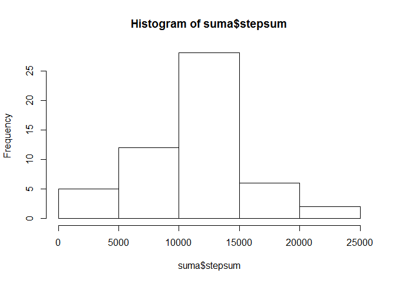
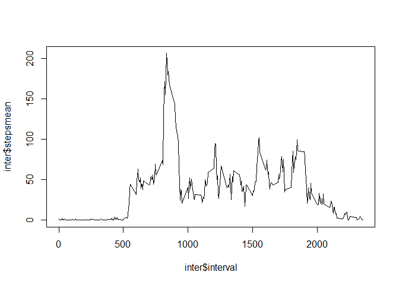
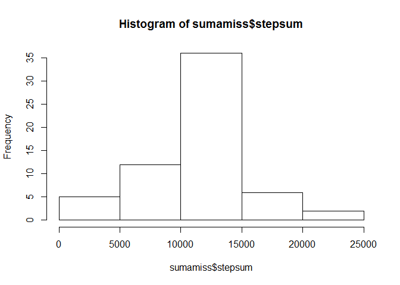

# Reproducible Research: Peer Assessment 1
##Setup  


```r
library("dplyr")
```

```
## 
## Attaching package: 'dplyr'
## 
## The following object is masked from 'package:stats':
## 
##     filter
## 
## The following objects are masked from 'package:base':
## 
##     intersect, setdiff, setequal, union
```

```r
library("markdown")
filez<-"activity.zip"
filec<-"activity.csv"
```

## Loading and preprocessing the data 

###Extracting the data file from the zip file  


```r
unzip(filez)
```

###Reading the data  


```r
data<-read.csv(filec)
```

###Filter lines with missing values  


```r
data<-data[complete.cases(data),]
```

## What is mean total number of steps taken per day?

###Sumarize data per day  


```r
suma<-summarise(group_by(data, date), sum(steps))
names(suma)<-c("date", "stepsum")
stepmn<-mean(suma$stepsum)
stepmd<-median(suma$stepsum)
```

The mean number of steps per day is 1.0766189\times 10^{4}  and the median 10765.  

###plot Histogram of total number of step taken each day  


```r
hist(suma$stepsum)
```

 

## What is the average daily activity pattern?  


```r
inter<-summarise(group_by(data, interval), mean(steps))
names(inter)<-c("interval", "stepsmean")
plot(inter$interval,inter$stepsmean, type="l")
```

 

###Interval with maximum of steps  


```r
maxi<-max(inter$stepsmean)
maxinter<-inter[inter$stepsmean==maxi,1]
```
The maximun average of steps is 206.1698113 and takes place during interval 835.  


## Imputing missing values


```r
data<-read.csv(filec)
missval<-sum(is.na(data$steps))
```

The number of missing values is 2304.  

An inner join and for next with and ifelse are used to convert  
all the NAs to the value of the mean of the steps for that interval.


```r
datamiss<-inner_join(data, inter)
```

```
## Joining by: "interval"
```

```r
for(i in 1:length(datamiss$steps)){
        ifelse(is.na(datamiss$steps[i]), datamiss$steps[i]<-datamiss$stepsmean[i], datamiss$stepsmean[i]<-0)       
}
sumamiss<-summarise(group_by(datamiss, date), sum(steps))
names(sumamiss)<-c("date", "stepsum")
stepmn<-mean(sumamiss$steps)
stepmd<-median(sumamiss$steps)
```

The mean number of steps per day is 1.0766189\times 10^{4}  and the median 1.0766189\times 10^{4}.  

###plot Histogram of total number of step taken each day 


```r
hist(sumamiss$stepsum)
```

 


## Are there differences in activity patterns between weekdays and weekends?
